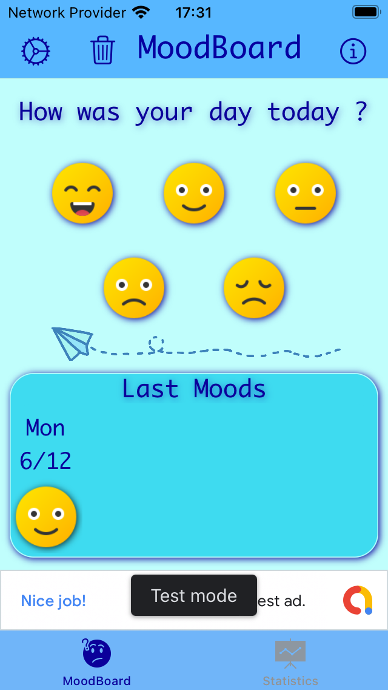
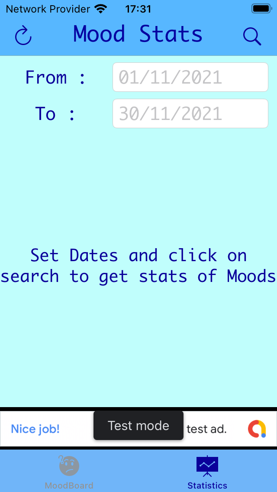
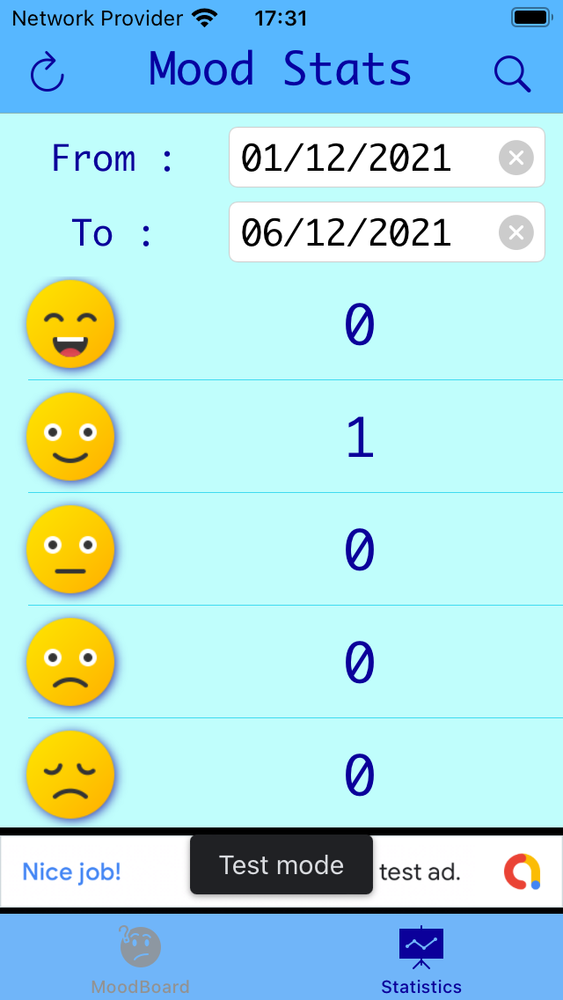
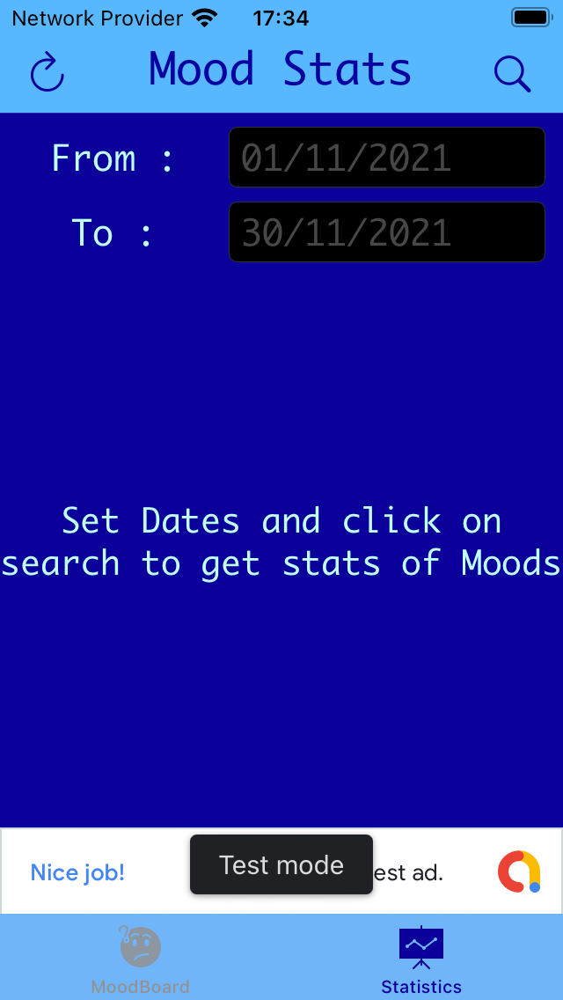
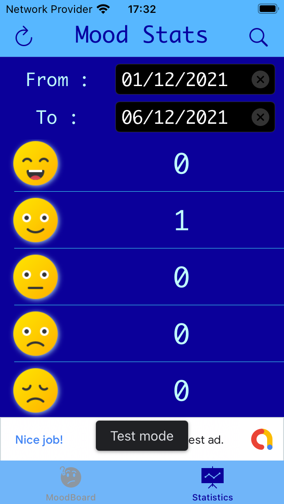

# Template-Project

  

### Fonctionnalités :

Pour l'utilisation de ce projet merci de télécharger le fichier **File.** avec le lien suivant :

Fichier :
Lien ... https://storage.googleapis.com/images-angelappdev/CoreML/Fichier.mlmodel

### Features :

To use this project, please download the **File.** file with the following link:

File :
Lien ... https://storage.googleapis.com/images-angelappdev/CoreML/Fichier.mlmodel

#### API :

Lien ... 

#### App previews and screenshots / Aperçus d’app et captures d’écran

| MoodBoard - Light mode | Statistics - Light mode | Statistics Search - Light mode |
| -------- | ------------- | ------------- |
| | | |

| MoodBoard - Dark mode | Statistics - Dark mode | Statistics Search - Dark mode |
| -------- | ------------- | ------------- |
| | | |

---

#### Credits :

Icons made by .pngtree.com : [Avion png de .pngtree.com ](https://.pngtree.com/so/Avion)

